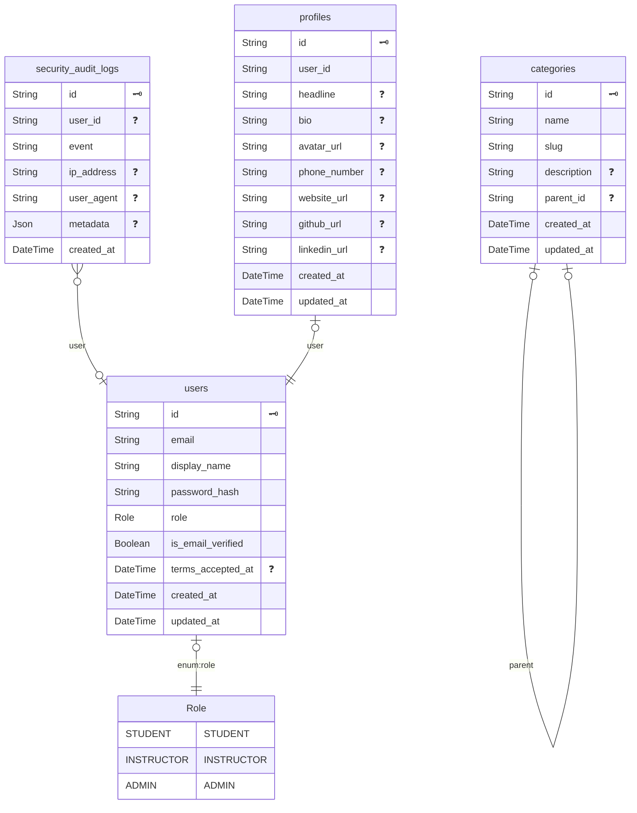

```mermaid
erDiagram

        Role {
            STUDENT STUDENT
INSTRUCTOR INSTRUCTOR
ADMIN ADMIN
        }
    
  "security_audit_logs" {
    String id "🗝️"
    String user_id "❓"
    String event 
    String ip_address "❓"
    String user_agent "❓"
    Json metadata "❓"
    DateTime created_at 
    }
  

  "categories" {
    String id "🗝️"
    String name 
    String slug 
    String description "❓"
    String parent_id "❓"
    DateTime created_at 
    DateTime updated_at 
    }
  

  "users" {
    String id "🗝️"
    String email 
    String display_name 
    String password_hash 
    Role role 
    Boolean is_email_verified 
    DateTime terms_accepted_at "❓"
    DateTime created_at 
    DateTime updated_at 
    }
  

  "profiles" {
    String id "🗝️"
    String user_id 
    String headline "❓"
    String bio "❓"
    String avatar_url "❓"
    String phone_number "❓"
    String website_url "❓"
    String github_url "❓"
    String linkedin_url "❓"
    DateTime created_at 
    DateTime updated_at 
    }
  
    "security_audit_logs" }o--|o "users" : "user"
    "categories" |o--|o "categories" : "parent"
    "users" |o--|| "Role" : "enum:role"
    "profiles" |o--|| "users" : "user"
```
